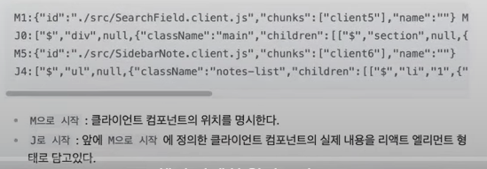
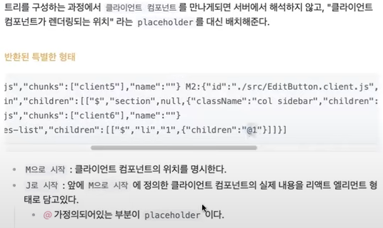

# REACT ClientComponents, Server-Components

## 소개
### React Server-compoents (RSC)
- 다양한 종류의 백엔드 리소스에 접근할 수 있다. (보여줘서 안될 데이터들은 여기서 정제가 가능한가?)
- 번들사이즈를 감소 시킬수있다. - 정적인 RSC부분은 번들에 포함되지않고, RCC부분만 번들링을함.
- 초기로딩시간이 단축되는 효과. FCP*가 빨라짐.
- 데이터를 효율적으로 미리 로드할수있음. 빠른 인터렉션을 제공할수있다. - TTI*가 빨라짐
- SEO가 필요한 페이지에 `정적인` 내용을 html로 반환이 필요할때. (ex - 게시판 초기 리스트)

*사용하는이유 : SEO가 되고 번들사이즈가 작아 FCP가 빠르다? 토큰이나 API키 처리?*

### React Client-components (RCC)
- 동적으로 작동하는 UI인경우.  (ex - 게시판 필터와 필터기준의 게시판 검색결과)
- input 값이 바뀐다던가, 실제 UI에서 쓰는값이 바뀌는 부분이 있다면 전부 CC에서 해결해야함 ( 기존에 useEffect, useRef 등을 사용해야 하는 상황 )

## RSC(ReactServerComponent)의 등장
- React18버전에 추가된 기능.
- CSR방식으로 번들링된 JS파일이 너무 커지면서 로딩이 느린 단점이있음. 이를 보안하기위해 Next.js와 같은 SSR방식이 등장함.
- 기존에 Next.js 에 SSR렌더링을 하는방법은 getServerSideProps 가 있었지만 아래와 같은 문제가 있었음.

````
1. getServerSideProps 는 Next.js 최상단 Page컴포넌트 에서만 작동함.
2. 랜더링이 끈난 상태로 HTML을 클라이언트로 내려주기 때문에, 데이터를 새로 가져와야할때는 새로고침을 해야한다.
    그래서 클라이언트상태*를 유지하기 어렵다.
*클라이언트상태: 포커스,인풋값등의 컴포넌트 내부에서 관리하는 상태를 의미함.
````
*ReactServerComponent는 한번 서버에서 랜더링 되었기때문에 페이지이동과 같은 라우터변경이 없다면 다시 렌더링되이않는다.? 이해안가는데?*



## 주의
- 서버에서 모든 RSC가 실행되며 중간에 RCC를 만나면 placeholder로 표기하고 넘어가게되는데, 이과정을 RCC내부에서 반환되는 RSC또한 서버에서 실행하지못한다.
  *23년12월기준 정보입니다. 해당부분 확인이 필요함.*

````javascript
'use client'; // 클라이언트 컴포넌트임을 명시

import ServerComponent from './ServerComponent';
export default function clientComponent(){ // 클라이언트 컴포넌트에서
  return {
    <ServerComponent /> // 서버컴포넌트를 사용하고 있다. (사용 불가)
  }
}

function ClientComponent({children}) {
  return <div onChange={...}>{children}</div>; // 사용가능
}

function ServerComponent(){
  return <div>Server component</div>
}

function Wrapper(){
  return {
    <ClientComponent> // 클라이언트 컴포넌트의
      <ServerComponent /> // children으로 서버 컴포넌트를 넣었다.(사용가능) 
    </ClientComponent>
  }
}
````

````javascript
function ClientComponent({children}){
  // children부분에 서버컴포넌트를 외부에서 넣주는건 가능하다.
  // children부분에 서버컴포넌트를 직접사용하는건 불가하다.

  return <div onChange={...}>{children}</div>; // 사용가능
  return <div onChange={...}><ServerCompoentn /></div>; // 사용불가
}
````

- ~~위 오류가 발생하는것을 막기위해 'server-only'라는 패키지를 사용하수잇다한다.~~
- ~~최상단에 임포트시키면 해당 코드가 클라이언트 컴포넌트에서 임포트되었을떄 빌드에러를 발생시켜준다고한다.~~
- 지금은 'use server'로 바뀐듯하다. (25.03.24 기준)
````javascript
import 'server-only' // 바뀐건지 확인필요.
'use server'; 
````

## RSC(리액트 서버컴포넌트) vs SSR(서버사이드랜더링)
- 서버 컴포넌트가 서버사이드렌더링을 대체하지 않는다.
- RSC로 작성한 CSR의 산출물은 JS이고,
- 그 JS를 기반으로 SSR된 산출물은 HTML이다.

- React 18부터 Server Component가 도입되었고 Next.js 13부터 지원한다.

- Server Compoent
  - 서버에서 HTML을 렌더링하여 브라우저에 응답한다.
  - Hydration 과정은 없다.
- Client Compoent
  - 서버에서 기본적인 HTML은 렌더링을 하여 브라우져에 응답한다.
  - Hydration(JS Interacivity)만 브라우져에서 이루어진다.

## 의문
- 동일한 로직이 필요한 경우 같은걸 두번쓰는가?
  -- Yes. 하지만 공통스크립트로 묶고, RSC,RCC 에서 각각 import 시킴.
- 그러면 한 page에 같은 로직을 수행 하는 component 가 Server 따로,Client 따로 두개 필요하게 되는데?
   -- Yes, 그렇게 해야함.
- 파일 네임 컨벤션은?
   -- boardList.server.tsx, boardList.client.tsx
- RSC였던부분이 요건변경으로 RCS로 변경되게된다면? 전부 수정 해야하는가? 문법이 다른데 어떻게 하는가?
   -- 데이터부분만 RSC로 처리하고 SEO관련 요건이 있다면 해당부분 초기값만 RSC로 처리하는거?
- SEO가 어디까지 긁어가는가?
   -- 로봇마다 다르지만 크롬은 통신상태를 기다렷다가 다 가져가고, 타 로봇은 아니라고 알고잇는데, 계속 업데이트 되는부분이 있어 추적불가능. 그냥 html로 주는부분만 가져간다고 생각하고 작업해야할듯.


*FCP - 최초 콘텐츠풀 페인트(*First Contentful Paint*)를 뜻하며, 웹 페이지가 로드되고 있다는 첫 번째 피드백을 사용자에게 제공하는 시점<br>
*TTI - (*Time to Interactive*)웹 페이지가 사용자의 상호작용에 준비가 되는 데 걸리는 시간을 측정하는 성능 지표
